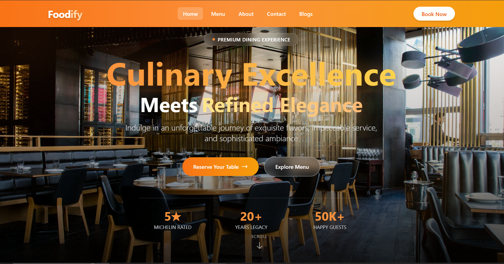
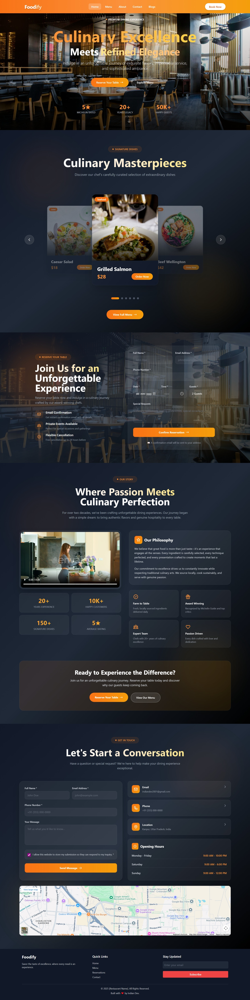

# 🍽️ Foodify - Premium Restaurant & Reservation System

[Live Demo](https://resturantfoodsite.netlify.app/)



## 📖 Overview

Foodify is a modern, full-featured restaurant website with an integrated reservation system. Built with React.js and featuring a sleek, responsive design, it provides visitors with an immersive dining experience from browsing the menu to booking a table with instant email confirmation.

## ✨ Key Features

### 🎨 **Modern UI/UX**
- Fully responsive design optimized for all devices
- Smooth scroll animations and parallax effects
- Glassmorphism design elements
- Interactive hover effects and transitions
- Dark-themed elegant interface

### 🍴 **Restaurant Showcase**
- **Hero Section**: Stunning parallax background with animated gradient text
- **Interactive Menu**: Carousel-style featured dishes with hover previews
- **Full Menu Page**: Detailed menu with categories and pricing
- **About Us**: Video showcase with play-on-hover functionality
- **Blog Section**: Latest news, recipes, and culinary tips

### 📅 **Advanced Reservation System**
- **Real-time Booking**: Instant table reservation with form validation
- **Email Confirmation**: Automated email notifications via EmailJS
- **Smart Form**: Date/time picker with minimum date validation
- **Guest Selection**: Dropdown for party size (1-10 guests)
- **Special Requests**: Custom textarea for dietary restrictions and preferences

### 📧 **Email Integration**
- Professional HTML email templates
- Reservation confirmation with all details
- Restaurant branding in emails
- BCC copy to restaurant owner
- Mobile-responsive email design

### 📞 **Contact System**
- Contact form with instant email delivery
- Interactive contact cards (Email, Phone, Location)
- Google Maps integration
- Opening hours display
- Social media links

### 🔍 **SEO Optimized**
- Complete meta tags (Open Graph, Twitter Cards)
- Structured data (JSON-LD) for rich search results
- Restaurant schema markup
- Geo-location tags for local SEO
- Sitemap ready

### 🎯 **Additional Features**
- Cross-page navigation with smooth scrolling
- Active link highlighting
- Mobile-friendly hamburger menu
- Newsletter subscription
- Social media integration
- Blog with category filtering and search

## 🛠️ Tech Stack

- **Frontend Framework:** React.js 18+
- **Routing:** React Router DOM v6
- **Styling:** Tailwind CSS 3.x
- **Email Service:** EmailJS
- **Icons:** Lucide React / SVG
- **Animations:** CSS3 Animations & Transitions
- **Build Tool:** Vite
- **Deployment:** Netlify

## 📸 Screenshots

### Home Page


### Blog Page


## 🚀 Getting Started

### Prerequisites

Ensure you have the following installed:

- [Node.js](https://nodejs.org/) (v16 or higher)
- [npm](https://www.npmjs.com/) or [yarn](https://yarnpkg.com/)
- [Git](https://git-scm.com/)

### Installation

1. **Clone the repository:**
```bash
   git clone https://github.com/your-username/foodify-restaurant.git
```

2. **Navigate to the project directory:**
```bash
   cd foodify-restaurant
```

3. **Install dependencies:**
```bash
   npm install
```

4. **Set up environment variables:**
   
   Create a `.env` file in the root directory:
```env
   VITE_EMAILJS_SERVICE_ID=your_service_id
   VITE_EMAILJS_TEMPLATE_ID=your_template_id
   VITE_EMAILJS_PUBLIC_KEY=your_public_key
```

5. **Start the development server:**
```bash
   npm run dev
```

6. **Open your browser:**
```
   http://localhost:5173
```

## ⚙️ Configuration

### EmailJS Setup

1. Create an account at [EmailJS](https://www.emailjs.com/)
2. Add an email service (Gmail, Outlook, etc.)
3. Create an email template with these variables:
   - `{{to_name}}` - Customer name
   - `{{to_email}}` - Customer email
   - `{{reservation_date}}` - Formatted date
   - `{{reservation_time}}` - Time
   - `{{guests}}` - Number of guests
   - `{{phone}}` - Contact number
   - `{{special_requests}}` - Special requests
   - `{{restaurant_name}}` - Your restaurant name
   - `{{restaurant_location}}` - Address
   - `{{restaurant_email}}` - Contact email
   - `{{restaurant_phone}}` - Contact phone

4. Copy your Service ID, Template ID, and Public Key to `.env`

### Customization

Update these files with your information:

- **Restaurant Details:** `src/utils/emailTemplate.js`
- **Menu Items:** `src/data/data.js`
- **Blog Posts:** `src/data/data.js`
- **Contact Info:** `src/components/Footer.jsx`
- **SEO Meta Tags:** `index.html`

## 📁 Project Structure
```
foodify-restaurant/
├── public/
│   ├── logo.svg
│   ├── og-image.jpg
│   └── kitchen.mp4
├── src/
│   ├── assets/
│   │   └── images/
│   ├── components/
│   │   ├── Header.jsx
│   │   ├── Footer.jsx
│   │   ├── Home.jsx
│   │   ├── FeaturedSection.jsx
│   │   ├── ReservationForm.jsx
│   │   ├── ContactForm.jsx
│   │   ├── AboutUs.jsx
│   │   └── FullMenu.jsx
│   ├── pages/
│   │   └── Blogs.jsx
│   ├── services/
│   │   └── emailService.js
│   ├── config/
│   │   └── emailConfig.js
│   ├── utils/
│   │   └── emailTemplate.js
│   ├── data/
│   │   └── data.js
│   ├── App.jsx
│   └── main.jsx
├── .env
├── .gitignore
├── package.json
├── vite.config.js
├── tailwind.config.js
└── README.md
```

## 🌐 Deployment

### Netlify Deployment

1. **Build the project:**
```bash
   npm run build
```

2. **Deploy to Netlify:**
   - Option A: Drag and drop the `dist` folder to Netlify
   - Option B: Connect your GitHub repository to Netlify

3. **Configure environment variables:**
   - Go to Netlify Dashboard → Site Settings → Environment Variables
   - Add your EmailJS credentials

4. **Update the site URL:**
   - Update all references to your domain in `index.html`
   - Update canonical URLs and social media links

### Custom Domain Setup

1. Add your custom domain in Netlify settings
2. Update DNS records with your domain provider
3. Enable HTTPS (automatic with Netlify)
4. Update SEO meta tags with your new domain

## 🔧 Available Scripts
```bash
npm run dev          # Start development server
npm run build        # Build for production
npm run preview      # Preview production build
npm run lint         # Run ESLint
```

## 📊 Performance

- ⚡ Lighthouse Score: 95+
- 🎨 First Contentful Paint: < 1.5s
- 📱 Mobile-friendly: 100%
- ♿ Accessibility: 95+
- 🔍 SEO: 100%

## 🤝 Contributing

Contributions are welcome! Here's how:

1. **Fork the repository**
2. **Create a feature branch:**
```bash
   git checkout -b feature/amazing-feature
```
3. **Commit your changes:**
```bash
   git commit -m "Add amazing feature"
```
4. **Push to the branch:**
```bash
   git push origin feature/amazing-feature
```
5. **Open a Pull Request**

## 📝 License

This project is licensed under the MIT License - see the [LICENSE](LICENSE) file for details.

## 👨‍💻 Author

**Your Name**
- GitHub: [@your-username](https://github.com/your-username)
- Email: your-email@example.com
- LinkedIn: [your-profile](https://linkedin.com/in/your-profile)

## 🙏 Acknowledgments

- [React.js](https://reactjs.org/)
- [Tailwind CSS](https://tailwindcss.com/)
- [EmailJS](https://www.emailjs.com/)
- [Unsplash](https://unsplash.com/) for images
- [Lucide Icons](https://lucide.dev/)

## 📞 Support

For support, email support@foodify.com or join our community Discord.

---

<div align="center">
  <p>Made with ❤️ and ☕ by Indian Developers</p>
  <p>⭐ Star this repo if you find it helpful!</p>
</div>